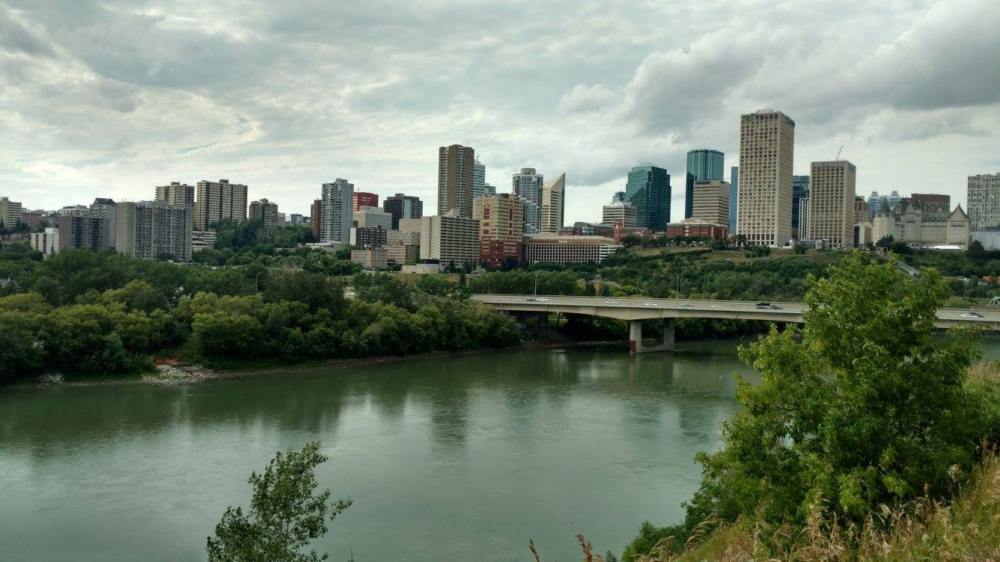
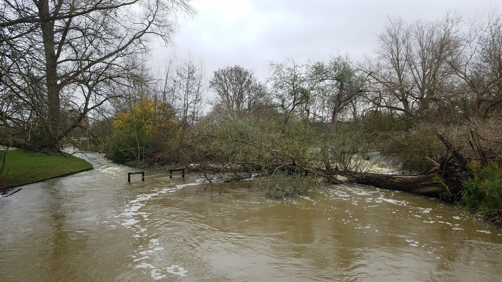
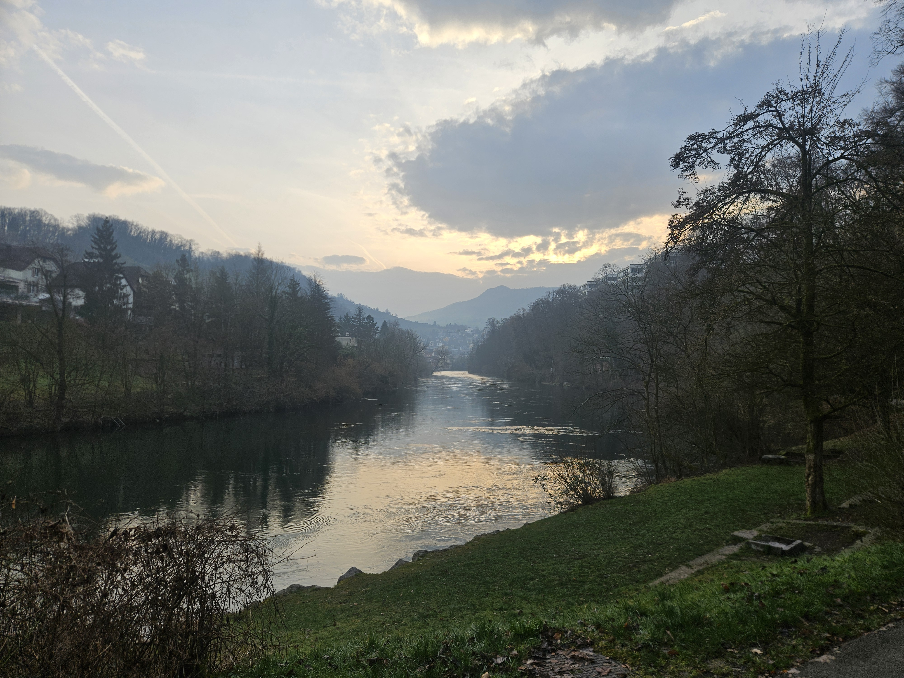

<<<<<<< HEAD

::: {.hero-full}

:::

::: {.home-layout}

::: {.home-sidebar}

<a href="mailto:bailey.anderson@slf.ch">
<i class="bi bi-envelope-fill"></i> Email
</a>

<a href="https://scholar.google.com/citations?user=40Ppn9IAAAAJ" target="_blank">
<i class="bi bi-mortarboard-fill"></i> Google Scholar
</a>

<a href="https://www.slf.ch/en/staff/anderson/" target="_blank">
<i class="bi bi-building"></i> WSL / ETH
</a>

:::

::: {.home-main}

# Bailey J. Anderson

## Hydrologist 

I seek to understand why apparently similar catchments respond differently to similar forcings, and how those responses emerge from interacting hydrological processes across space and time.

[Research](research.qmd){.button} [Download CV](cv.qmd){.button}

## Research Themes

::: {.research-grid}

::: {.research-card}

### Catchment response diversity

Why do apparently similar catchments respond differently?
:::

::: {.research-card}

### Hydroclimatic extremes

Understanding floods, droughts and seasonal streamflow.
:::

::: {.research-card}

### Hydrological processes

Integrating observations, modelling and large-sample hydrology.
:::

:::

:::

=======

::: {.hero-full}

:::

::: {.home-layout}

::: {.home-sidebar}

<a href="mailto:bailey.anderson@slf.ch">
<i class="bi bi-envelope-fill"></i> Email
</a>

<a href="https://scholar.google.com/citations?user=40Ppn9IAAAAJ" target="_blank">
<i class="bi bi-mortarboard-fill"></i> Google Scholar
</a>

<a href="https://www.slf.ch/en/staff/anderson/" target="_blank">
<i class="bi bi-building"></i> WSL / ETH
</a>

:::

::: {.home-main}

# Bailey J. Anderson

## Hydrologist 

I seek to understand why apparently similar catchments respond differently to similar forcings, and how those responses emerge from interacting hydrological processes across space and time.

[Research](research.qmd){.button} [Download CV](cv.qmd){.button}

## Research Themes

::: {.research-grid}

::: {.research-card}

### Catchment response diversity

Why do apparently similar catchments respond differently?
:::

::: {.research-card}

### Hydroclimatic extremes

Understanding floods, droughts and seasonal streamflow.
:::

::: {.research-card}

### Hydrological processes

Integrating observations, modelling and large-sample hydrology.
:::

:::

:::

>>>>>>> b30ac3677a249c3a9e8a17a28c6409a2a0d69579
:::